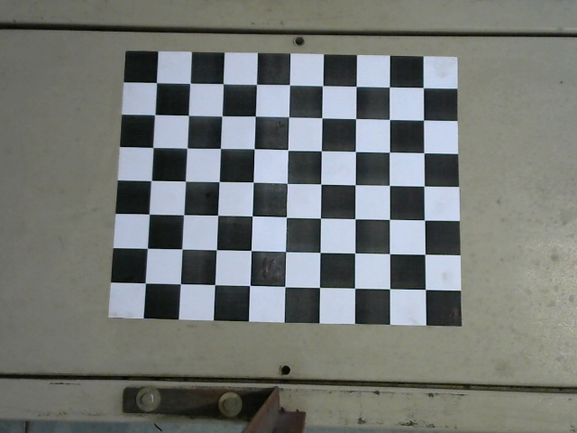
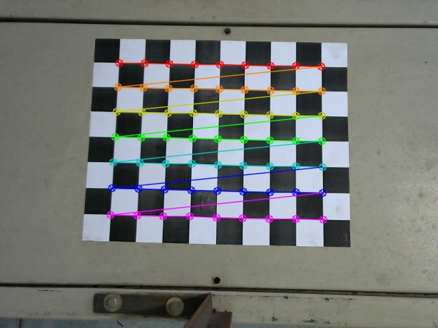

# [Camera Calibration using OpenCV](https://docs.opencv.org/3.4/dc/dbb/tutorial_py_calibration.html)

***Text copied from OpenCV documentation***

*The important input data needed for calibration of the camera is the set of 3D real world points and the corresponding 2D coordinates of these points in the image.* 

1. 2D image points are OK which we can easily find from the image. These image points are locations where two black squares touch each other in chess boards.

2. What about the 3D points from real world space? Those images are taken from a static camera and chess boards are placed at different locations and orientations. So we need to know (X,Y,Z) values. **But for simplicity, we can say chess board was kept stationary at XY plane, (so Z=0 always) and camera was moved accordingly.** This consideration helps us to find only X,Y values. Now for X,Y values, we can simply pass the points as (0,0), (1,0), (2,0), ... which denotes the location of points. In this case, the results we get will be in the scale of size of chess board square. But if we know the square size, (say 30 mm), we can pass the values as (0,0), (30,0), (60,0), ... . Thus, we get the results in mm. (In this case, we don't know square size since we didn't take those images, so we pass in terms of square size).

*3D points are called **object points** and 2D image points are called **image points.***

### Note that in openCV [`cv.calibrateCamera()`](https://docs.opencv.org/4.x/d9/d0c/group__calib3d.html#ga3207604e4b1a1758aa66acb6ed5aa65d) expects the real world coordinates of the checker board pattern intersect points with respect to a known coordinate system! This coordinate system must be considered when we map 2D image points from image to the real world and therefore shoul be a fixed and known coordinate system.

## *Note*
* **Image size:** 640 x 480 pixels<br>
* **Camera:** [Logitech C310 HD Webcam, 720p Video](https://support.logi.com/hc/en-us/articles/360023464573-Logitech-HD-Webcam-C310-Technical-Specifications)<br>
* **Square Size of Checkerboard:** 30 mm (*useful in camera calibration*)<br>
* **Lens and Sensor Type:**	Plastic, CMOS<br>
* **Focus Type:**	Fixed<br>
* **Field of View (FOV):**	60°<br>
* **Focal Length:**	4.4mm (*useful in 2D to 3D coordinate transformation*)<br>


## Calibration Parameters (Intrinsic parameters -> Common for all the images)
```
------------------------------------------------------------
Camera Matrix:
 [[806.14517655   0.         323.87146568]
 [  0.         811.24976479 236.50327395]
 [  0.           0.           1.        ]]
------------------------------------------------------------ 

Distortion Coefficients:
 [[-3.80673064e-02  1.00564222e+00 -1.28647942e-03  3.27139495e-03 -1.79549627e+00]] 
------------------------------------------------------------

Real world object points: units in 30 mm 
#  ---> Y (9)
# |
# |
# X (7)
# (0,0,0), (0,1,0), (0,2,0) ....,(0,8,0)
# (1,0,0), (1,1,0), (1,2,0) ....,(1,8,0)
# (2,0,0), (2,1,0), (2,2,0) ....,(2,8,0)
# ....
# (6,0,0), (6,1,0), (6,2,0) ....,(6,8,0)

First Row
[[  0.   0.   0.]
 [  0.  30.   0.]
 [  0.  60.   0.]
 [  0.  90.   0.]
 [  0. 120.   0.]
 [  0. 150.   0.]
 [  0. 180.   0.]
 [  0. 210.   0.]
 [  0. 240.   0.]

Second Row
 [ 30.   0.   0.]
 [ 30.  30.   0.]
 [ 30.  60.   0.]
 [ 30.  90.   0.]
 [ 30. 120.   0.]
 [ 30. 150.   0.]
 [ 30. 180.   0.]
 [ 30. 210.   0.]
 [ 30. 240.   0.]

```


# Extrinsic Parameters of : `raw_images/image36.jpg` (Specific for an image )

|*raw image* | *processed image*|
|:----:|:----:|
||  |

```

Translational Vector: 
 [-122.22738712] [-117.38511046] [656.31453705]
------------------------------------------------------------

Rotational Vector:    
 [2.10602313] [2.15303455] [-0.19642816]
------------------------------------------------------------
 
Image Points:
# ---> (X)
# |
# | 
# (Y)

First Row
[[ 173.54767, 91.62902 ]
[ 210.7686, 92.32755 ]
[ 247.47551, 92.77607 ]
[ 284.47098, 93.51474 ]
[ 321.1669, 94.06741 ]
[ 357.76126, 95.03036 ]
[ 395.10233, 95.69413 ]
[ 431.89203, 96.42651 ]
[ 469.4813, 97.2708 ]

Second Row
[ 171.63728, 127.19049 ]
[ 209.06671, 127.80512 ]
[ 246.2503, 128.5212 ]
[ 283.181, 128.65028 ]
[ 320.31326, 129.6341 ]
[ 357.05832, 130.68134 ]
[ 394.54123, 131.55125 ]
[ 432.02014, 132.50407 ]
[ 469.7123, 133.17534 ]

```

**Output vector of rotation vectors ([Rodrigues](https://docs.opencv.org/4.x/d9/d0c/group__calib3d.html#ga61585db663d9da06b68e70cfbf6a1eac) ) estimated for each pattern view 
(e.g. std::vector<cv::Mat>>). That is, each i-th rotation vector together with 
the corresponding i-th translation vector, 
brings the calibration pattern from the object coordinate space 
(in which object points are specified)  to the camera coordinate space.
In more technical terms, the tuple of the i-th rotation and translation vector 
performs a change of basis from object coordinate space to camera coordinate space.
Due to its duality, this tuple is equivalent to the position of the calibration 
pattern with respect to the camera coordinate space.**

# Image to Real world Transformation: progress with the commits

<details>
  <summary>25/02/2022: Backprojection implemenation v1: Reference Book: HZ</summary>
  <br> Page 6: https://engineering.purdue.edu/kak/computervision/ECE661Folder/Lecture17.pdf

 
 *Note that there is a nearly 30 mm distance gap in Y coordinate of the resulted World coordinae. That indicates we are heading the correct direction towrads the implementation.*
 
  ```
 _3Dto2Dtransformation shape:  (3, 4)
Homogeneous Image Coord:  [172.5165863   90.92301178   1.        ]
Real World Coordinates:  [-0.28 -0.96  0.3   1.  ] 
 --------------------------------------------------------------------------------
Homogeneous Image Coord:  [210.02690125  91.49441528   1.        ]
Real World Coordinates:  [-2.42 28.75 -5.05  1.  ]
 --------------------------------------------------------------------------------
Homogeneous Image Coord:  [247.15162659  91.94928741   1.        ]
Real World Coordinates:  [ -4.66  58.63 -10.41   1.  ]
 --------------------------------------------------------------------------------
Homogeneous Image Coord:  [284.48806763  92.66139984   1.        ]
Real World Coordinates:  [ -6.75  89.2  -15.95   1.  ]
 --------------------------------------------------------------------------------
Homogeneous Image Coord:  [321.52206421  93.30630493   1.        ]
Real World Coordinates:  [ -8.91 120.02 -21.53   1.  ]
 --------------------------------------------------------------------------------
Homogeneous Image Coord:  [358.53991699  94.29839325   1.        ]
Real World Coordinates:  [-10.83 151.37 -27.3    1.  ]
 --------------------------------------------------------------------------------
Homogeneous Image Coord:  [396.13839722  95.03894806   1.        ]
Real World Coordinates:  [-13.03 183.76 -33.18   1.  ]
 --------------------------------------------------------------------------------
Homogeneous Image Coord:  [433.16867065  95.80253601   1.        ]
Real World Coordinates:  [-15.2  216.21 -39.09   1.  ]
 --------------------------------------------------------------------------------
  ```  
</details>

<details>
  <summary>01/03/2022: Backprojection implemenation using the method specified in the paper.</summary>
  <br> Paper: https://doi.org/10.1007/978-3-642-40567-9_1

 
 *Approximation Successful. Paper Implementation Worked.*
 
  ```
  Image point:  [171.64 127.19   1.  ]
Approx: world coord:  [29.97  0.49  0.  ]

 --------------------------------------------------
Image point:  [209.07 127.81   1.  ]
Approx: world coord:  [29.84 30.62  0.  ]

 --------------------------------------------------
Image point:  [246.25 128.52   1.  ]
Approx: world coord:  [29.79 60.53  0.  ]

 --------------------------------------------------
Image point:  [283.18 128.65   1.  ]
Approx: world coord:  [29.27 90.21  0.  ]

 --------------------------------------------------
Image point:  [320.31 129.63   1.  ]
Approx: world coord:  [ 29.45 120.06   0.  ]

 --------------------------------------------------
Image point:  [357.06 130.68   1.  ]
Approx: world coord:  [ 29.69 149.57   0.  ]

 --------------------------------------------------
Image point:  [394.54 131.55   1.  ]
Approx: world coord:  [ 29.77 179.66   0.  ]

 --------------------------------------------------
Image point:  [432.02 132.5    1.  ]
Approx: world coord:  [ 29.92 209.72   0.  ]

 --------------------------------------------------
Image point:  [469.71 133.18   1.  ]
Approx: world coord:  [ 29.83 239.94   0.  ]

 --------------------------------------------------

  ```  

</details>

# Reference Paper 

Siswantoro J., Prabuwono A.S., Abdullah A. (2013) ***Real World Coordinate from Image Coordinate Using Single Calibrated Camera Based on Analytic Geometry***. In: Noah S.A. et al. (eds) Soft Computing Applications and Intelligent Systems. M-CAIT 2013. Communications in Computer and Information Science, vol 378. Springer, Berlin, Heidelberg. https://doi.org/10.1007/978-3-642-40567-9_1
