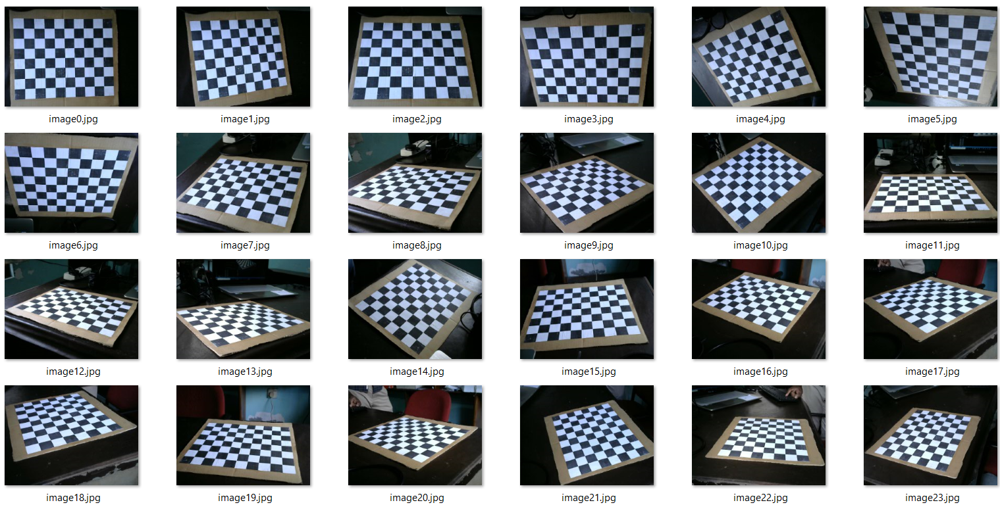

# [Camera Calibration using OpenCV](https://docs.opencv.org/3.4/dc/dbb/tutorial_py_calibration.html)

***Text copied from OpenCV documentation***

*The important input data needed for calibration of the camera is the set of 3D real world points and the corresponding 2D coordinates of these points in the image.* 

1. 2D image points are OK which we can easily find from the image. These image points are locations where two black squares touch each other in chess boards.

2. What about the 3D points from real world space? Those images are taken from a static camera and chess boards are placed at different locations and orientations. So we need to know (X,Y,Z) values. But for simplicity, we can say chess board was kept stationary at XY plane, (so Z=0 always) and camera was moved accordingly. This consideration helps us to find only X,Y values. Now for X,Y values, we can simply pass the points as (0,0), (1,0), (2,0), ... which denotes the location of points. In this case, the results we get will be in the scale of size of chess board square. But if we know the square size, (say 30 mm), we can pass the values as (0,0), (30,0), (60,0), ... . Thus, we get the results in mm. (In this case, we don't know square size since we didn't take those images, so we pass in terms of square size).

*3D points are called **object points** and 2D image points are called **image points.***

## *Note*
* **Image size:** 640 x 480 pixels<br>
* **Camera:** [Logitech C310 HD Webcam, 720p Video](https://support.logi.com/hc/en-us/articles/360023464573-Logitech-HD-Webcam-C310-Technical-Specifications)<br>
* **Square Size of Checkerboard:** 30 mm (*useful in camera calibration*)<br>
* **Lens and Sensor Type:**	Plastic, CMOS<br>
* **Focus Type:**	Fixed<br>
* **Field of View (FOV):**	60°<br>
* **Focal Length:**	4.4mm (*useful in 2D to 3D coordinate transformation*)<br>

## Method 1: Static camera and chess boards are placed at different locations

```
Camera Matrix:
 [[824.56316122   0.         329.56730044]
 [  0.         823.63476754 260.06591151]
 [  0.           0.           1.        ]]

Distortion Coefficients:
 [[0.00785561 0.41494786 0.00960021 0.00577902 1.53307777]]

```


## Method 2: Stationary Chess board kept  at XY plane, (so Z=0 always) and camera was moved accordingly

```
Camera Matrix:
 [[822.63896404   0.         321.51943526]
 [  0.         821.2420443  235.09146444]
 [  0.           0.           1.        ]]

Distortion Coefficients:
 [[ 2.50484044e-02  4.93438361e-01 -4.12081388e-03  3.21794242e-05 -3.72201958e-01]]

```



# [Results obtained using MATLAB Camera Calibrator Toolbox](https://www.mathworks.com/help/vision/ug/using-the-single-camera-calibrator-app.html)

## Method 1: Static camera

```
Intrinsics
----------
Focal length (pixels):   [  825.1877 +/- 0.8995      824.7388 +/- 0.8549  ]
Principal point (pixels):[  334.5468 +/- 1.7715      259.1855 +/- 1.3978  ]
Radial distortion:       [    0.0456 +/- 0.0209       -0.0419 +/- 0.4124        2.9397 +/- 2.3712  ]
Tangential distortion:   [    0.0086 +/- 0.0007        0.0074 +/- 0.0009  ]

```

## Method 2: Stationary Chess board kept  at XY plane

```
Intrinsics
----------
Focal length (pixels):   [  821.2748 +/- 0.7316      820.7591 +/- 0.8375  ]
Principal point (pixels):[  319.7093 +/- 1.7312      236.3201 +/- 1.1469  ]
Radial distortion:       [    0.0650 +/- 0.0212       -0.1310 +/- 0.4461        2.1357 +/- 2.7396  ]
Tangential distortion:   [   -0.0039 +/- 0.0006       -0.0019 +/- 0.0009  ]

```

# Scripts

|Script|Description|
|:---|:---|
|**captureImages.py**|*This script captures images from the camera and saves them in the specified directory.*|
|**calibrateCamera.py**|*This script calibrates the camera and saves the calibration parameters in the specified yaml file.*|
|**undistortImage.py**|*This script undistorts the image using the calibration parameters.*|
